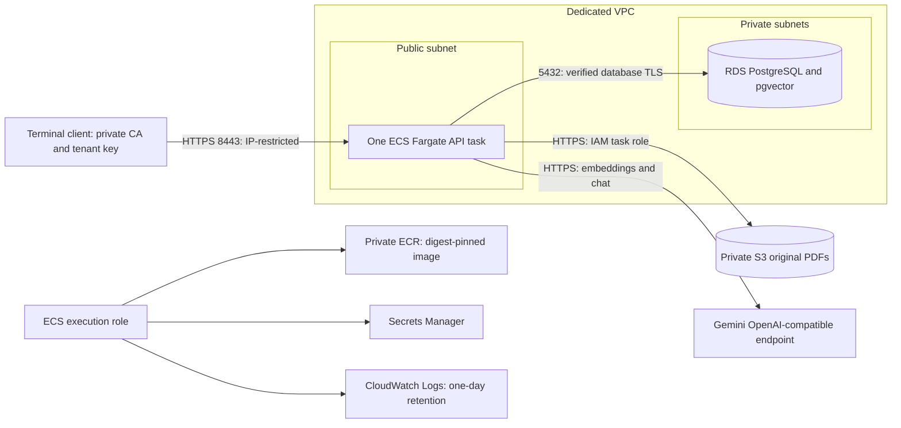

# AWS RAG deployment lab

Verified October 5, 2026 in `us-east-2`. Application source: commit
`7b61385d3f5e472215d89d041761981fdd52fcd1`.

This lab deploys the existing document-assistant API, not the planned
credit-surveillance agent. It demonstrates authenticated ingestion, retrieval,
answer generation, original-file storage, and persistence across container
replacement. Provisioning was manual and incremental; these documents and the
[task template](api-task-definition.template.json) are a sanitized reference,
not a ready-to-run infrastructure stack. Account-specific helper scripts and
secret-bearing local files are deliberately not copied into the repository.

**Checkpoint:** the document workflow and task-replacement test passed. Browser
access, agents, teardown, and the final Billing check were not completed at the
recorded checkpoint. This date-stamped record does not imply a currently live
endpoint. No hosted endpoint, account ID, personal IP, or credentials are
published here.

## Architecture



S3 is accessed through its HTTPS service endpoint; it is not deployed inside a
private subnet. PostgreSQL is authoritative for document/scope state. Embeddings
are derived data stored in pgvector. Original PDF bytes are stored separately
in S3, and PostgreSQL records the `storage_uri`.

| Component | Recorded configuration |
|---|---|
| API | FastAPI; synchronous ingestion; tenant-scoped `X-API-Key` |
| Compute | Fargate Linux/x86_64; 0.5 vCPU; 1 GiB; desired count 1 |
| Database | RDS PostgreSQL 17.11; `db.t4g.micro`; Single-AZ; encrypted 20 GiB gp3; non-public |
| Schema | Alembic `0002_tenant_api_keys`; vector extension 0.8.2; `vector(768)` |
| Originals | S3 Block Public Access; ACLs disabled; SSE-S3; HTTPS-only policy |
| Embeddings | `gemini-embedding-001`; explicitly requested 768 dimensions |
| Chat | `gemini-3.6-flash`; working configuration at the verification date |
| Model endpoint | `https://generativelanguage.googleapis.com/v1beta/openai/` |
| HTTPS | Temporary private CA; server hostname `rag-lab.test`; port 8443 |
| Logs | One-day retention; Container Insights disabled; API access logs disabled |
| Availability | One API task and Single-AZ database; no high-availability claim |

## Access and cost tradeoffs

The task receives a public IP in a public subnet so it can reach the external
model provider and AWS HTTPS endpoints without a NAT gateway. Its security group
allows inbound 8443 only from the operator's current public IP `/32`, outbound
443 to the internet, and outbound 5432 to the database security group. RDS accepts
5432 only from the task security group. Security groups are stateful.

The VPC has two public and two private subnets across two zones. The RDS subnet
group uses the private subnets, but the instance remains Single-AZ. Private route
tables have no internet route. There is no ALB, NAT gateway, paid VPC endpoint,
or AWS Private CA in this lab.

A private CA avoided requiring a registered domain for terminal testing. The
client used `--cacert` and `--resolve` rather than disabling TLS verification.
The server certificate was valid for seven days; certificate renewal and stable
public HTTPS are outside this lab. The IP restriction is tied to an internet
connection, not a particular laptop.

This setup is suitable for a controlled synthetic-data lab. A public product
would need a stable address, publicly trusted HTTPS, user access management,
quotas, backups, monitoring, and an appropriate availability design.

## Manual deployment sequence

Every resource-creating step was explained with its cost and reversal before the
operator executed it. Do not apply the template directly to an account without
replacing placeholders and inspecting existing resources.

1. **Inspect source and account.** Review Git status, Dockerfile, configuration,
   migrations, storage code, and CI. Inventory AWS resources, credits, billing,
   and permissions read-only. Agree on region, cost allowance, and teardown.
2. **Probe the provider locally.** Check that the stored key works, embeddings
   contain exactly 768 finite nonzero values, and chat produces text. A local
   pass does not establish reachability from ECS.
3. **Prepare the lab image.** Include `app/`, `alembic.ini`, `migrations/`, the
   public RDS CA bundle, and lab HTTPS startup/health helpers. Use a non-root
   user, exclude `.env`/credentials, build Linux/amd64, and validate the image.
   The repository's default Dockerfile is the HTTP development image; it is not
   the complete HTTPS lab image used in this exercise.
4. **Create networking and storage.** Create the dedicated VPC/subnets, security
   groups, private RDS subnet group, and private S3 bucket. Block public S3 access,
   disable ACLs, enable default encryption, and deny insecure transport. A
   transport-deny policy does not grant access.
5. **Create restricted runtime roles.** The ECS execution role pulls the exact
   ECR repository, writes to the designated log group, and reads exact startup
   secrets. The task role allows `s3:PutObject` and `s3:AbortMultipartUpload` only
   beneath the demo tenant prefix. No stored AWS keys are supplied to the app.
6. **Publish the artifact and configure secrets.** Create private ECR with
   immutable tags; push and record the image digest. Create the log group and
   cluster. Keep the CA private key local; store only the server certificate,
   server private key, and public CA certificate in the TLS secret. Reuse the
   existing model secret without publishing its value.
7. **Create private RDS.** Choose an available PostgreSQL version with pgvector
   support; verify encryption, non-public access, private subnet group, and
   security group. Use the RDS-managed administrator secret for setup only.
8. **Run a one-off migration task.** Connect with `sslmode=verify-full` and the
   RDS CA bundle; apply Alembic; verify its head and vector column; call
   `app.demo_seed` separately to seed the idempotent demo scope. Schema
   migrations themselves do not insert seed records.
9. **Bootstrap the application identity.** Generate and store the `ragapp`
   credential securely. Grant SELECT on the runtime tables and document/fact
   CRUD, but no administrator flags, schema creation, or API-key insertion.
   Probe embedding and chat requests from Fargate.
10. **Issue a tenant key without logging it.** Generate the raw key locally into
    a protected header file outside the repository (directory 0700, file 0600).
    Send only its SHA-256 hash to a one-off key-issuance task. Remove temporary
    administrator-secret retrieval permission before launching the API.
11. **Run the service.** Register the definition and create a one-task service.
    Verify task health and client-side HTTPS `/health` and `/health/ready`.
    Confirm unauthenticated `/search` returns 401.
12. **Verify the document workflow and replacement.** Follow the checks below,
    inspect S3 and RDS directly, force a new deployment, confirm task identity
    changes, and repeat retrieval without ingestion.
13. **Tear down and check Billing.** Follow the [complete checklist](cost-and-teardown.md).
    This final step was still pending at the recorded checkpoint.

Human provisioning access and runtime access are separate. The operator used an
administrator IAM identity after inventory/provisioning permission gaps; the
runtime roles were restricted. This is not a claim that the operator identity
itself was least-privilege.

## Using the task-definition reference

[api-task-definition.template.json](api-task-definition.template.json) records
CPU/memory, role separation, secret selectors, port, health checks, and logging.
It is valid JSON with intentionally non-deployable `<PLACEHOLDER>` values. It
assumes the separately prepared lab image contains `/app/lab_start.py` and
`/app/lab_health.py` and serves verified HTTPS. Pointing it at the default
repository image will not produce that behavior.

Secret values stay in Secrets Manager. The database secret's `DATABASE_URL`
uses the `postgresql+psycopg` driver, the RDS hostname rather than `localhost`,
and `sslmode=verify-full` with `sslrootcert=/app/rds-ca-bundle.pem`. JSON-key
secret selectors require a compatible Fargate platform; the lab used 1.4.0.

The execution role and task role are different. Secret injection uses the
execution role; application S3 calls use the task role. The restricted database
login is a third, independent permission boundary.

## Test the synthetic fixture

Use only the [synthetic PDF](fixtures/synthetic-examplecorp-q2-2025.pdf).
Configure these non-secret paths/addresses locally; never put a raw key into
shell history, screenshots, or Git:

```bash
LAB_API_IP="<current-task-public-ip>"
LAB_CA_FILE="<absolute-path-to-public-ca.pem>"
LAB_HEADER_FILE="<absolute-path-to-protected-api-key-header.txt>"
```

The header file contains `X-API-Key: <raw-key>` and is created privately, not by
copying a real key into these docs. From the repository root, test liveness and
readiness, then verify a missing key is rejected:

```bash
curl --fail --silent --show-error --max-time 20 \
  --cacert "$LAB_CA_FILE" --resolve "rag-lab.test:8443:$LAB_API_IP" \
  https://rag-lab.test:8443/health
curl --fail --silent --show-error --max-time 20 \
  --cacert "$LAB_CA_FILE" --resolve "rag-lab.test:8443:$LAB_API_IP" \
  https://rag-lab.test:8443/health/ready
curl --silent --show-error --max-time 20 \
  --cacert "$LAB_CA_FILE" --resolve "rag-lab.test:8443:$LAB_API_IP" \
  --header 'Content-Type: application/json' \
  --data '{"queries":["synthetic lab test"],"top_k":1}' \
  --write-out '\nHTTP %{http_code}\n' https://rag-lab.test:8443/search
```

Expected health responses are 200; unauthenticated search is 401. Readiness
checks PostgreSQL, not the entire model/storage workflow.

Ingest into the demo borrower and Q2 reporting period created by `app.demo_seed`:

```bash
curl --fail-with-body --silent --show-error --max-time 180 \
  --cacert "$LAB_CA_FILE" --resolve "rag-lab.test:8443:$LAB_API_IP" \
  --header @"$LAB_HEADER_FILE" \
  --form 'files=@docs/aws-rag-lab/fixtures/synthetic-examplecorp-q2-2025.pdf;type=application/pdf' \
  --form 'borrower_id=69911c0b-802e-54fb-aa6d-ff8291f80e89' \
  --form 'reporting_period_id=11b968c9-c5c8-59af-8545-f7b85cf46ffa' \
  --write-out '\nHTTP %{http_code}\n' https://rag-lab.test:8443/ingest
```

Then POST the fixture requests to `/search` and `/answer` respectively:

```bash
curl --fail-with-body --silent --show-error --max-time 180 \
  --cacert "$LAB_CA_FILE" --resolve "rag-lab.test:8443:$LAB_API_IP" \
  --header @"$LAB_HEADER_FILE" --header 'Content-Type: application/json' \
  --data-binary @docs/aws-rag-lab/fixtures/search-request.json \
  --write-out '\nHTTP %{http_code}\n' https://rag-lab.test:8443/search
curl --fail-with-body --silent --show-error --max-time 180 \
  --cacert "$LAB_CA_FILE" --resolve "rag-lab.test:8443:$LAB_API_IP" \
  --header @"$LAB_HEADER_FILE" --header 'Content-Type: application/json' \
  --data-binary @docs/aws-rag-lab/fixtures/answer-request.json \
  --write-out '\nHTTP %{http_code}\n' https://rag-lab.test:8443/answer
```

The fixture requests use the recorded deterministic demo document ID. Confirm
it matches the ingestion response; other tenant IDs or PDF bytes require an
updated request. Both requests set `max_distance` to `null` for this initial
smoke test, so they do not validate threshold calibration. Search makes model
embedding requests; answer also invokes the chat model and incurs provider cost.

Inspect S3 object metadata and download the object with authenticated operator
access. Compare its SHA-256 with the fixture. Inspect RDS using a short-lived task
with the restricted login and an explicitly read-only transaction. Do not open
RDS to your laptop just to inspect it.

## Persistence test

Save the current task ID and the document/chunk IDs, then force replacement:

```bash
aws ecs update-service --cluster <LAB_CLUSTER> --service <LAB_SERVICE> \
  --force-new-deployment --profile <LAB_PROFILE> --region us-east-2
```

This creates a replacement task and retires the old one; temporary overlap adds
compute/IP cost. Confirm the replacement is healthy, the old task stops, and the
service settles back to one task. Retrieve the replacement's public IP, update
`LAB_API_IP`, and repeat health and search using the original key/request.
**Do not re-ingest the PDF.** Compare document/chunk identities and text; model
query embeddings may vary, so identical distances are not universally required.

The recorded run returned identical IDs, text, ranking, and distances. That
proves application-task replacement did not lose this document's persisted
state; it is not a database failover, backup restore, or broad quality test.

## Further work

Browser access is deferred; no hostname/Keychain setup was verified. Financial
fact extraction, leverage rules, agent investigation, and human review remain
future product work. Production work also includes asynchronous ingestion,
upload/rate limits, individual identity, key lifecycle management, backups with
restore tests, monitoring/alerts, prompt-injection defenses, RAG evaluation,
and infrastructure/deployment automation. Existing GitHub Actions tests mock
model calls; they do not deploy to AWS or prove live provider connectivity.
